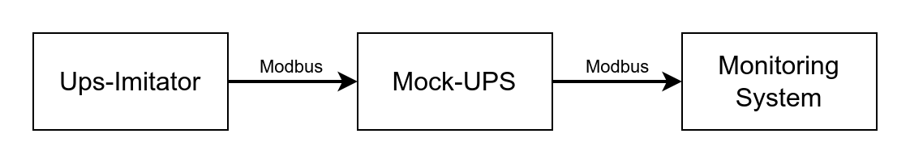
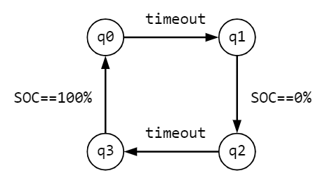
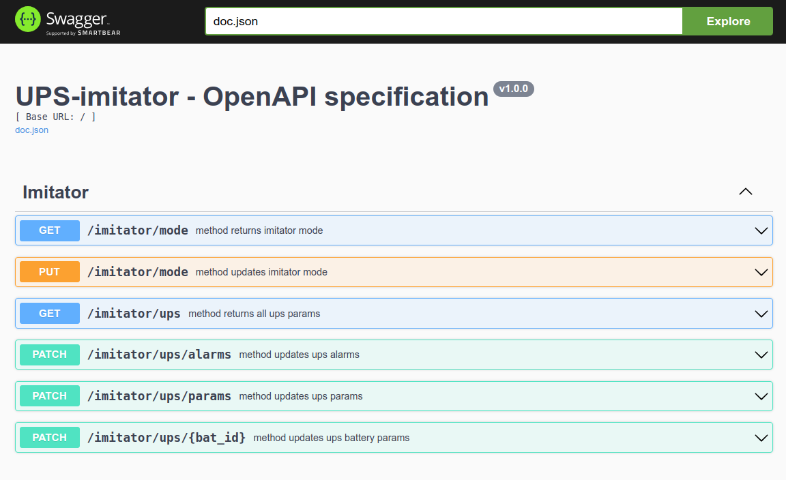
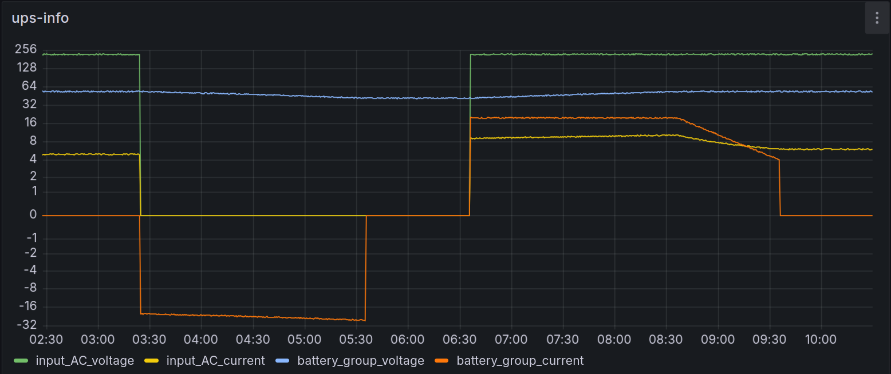
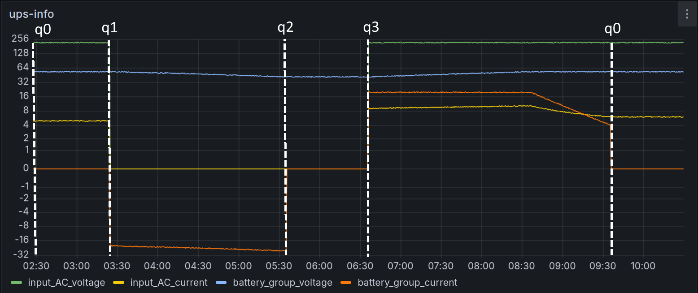

# Ups-imitator

Simulates the operation of UPS, calculates and loads current parameter values ​into it via Modbus  
Intended for testing the monitoring system  

Work scheme  
  

In this work was used [mock ups controller](https://github.com/apayvin11/mock-ups-ctrl)  

## Operating modes

1) Auto  
    Work in cycle:  
    * q0 — The electrical network is connected, the battery is charged;  
    * q1 — The electrical network is turned off, the battery is discharging;  
    * q2 — The electrical network is turned off, the battery is discharged;  
    * q3 — The electrical network is connected, the battery is charging.  

      
  
1) Manual  
   
   Manually changing parameters via rest api  
   [Swagger documentation](http://localhost:8080/swagger/index.html) 
     

## Getting started

1) Prepare [config](conf/config.toml)  
   example:

   ```txt
    ups_addr = "127.0.0.1:1502"
    rest_api_bind_addr = ":8080"
    ups_sync_interval = 30 # sec

    cycle_change_timeout = 3600 # sec

    default_input_ac_voltage    = 220   # V
    max_bat_group_voltage       = 54    # V
    min_bat_group_voltage       = 42    # V
    load_power                  = 1000  # W
    default_bat_capacity        = 50    # Ah
    charge_current_limit        = 20    # A
    low_soc_trigger_alarm       = 0.1   # from 0 to 1, 1: 100%
   ```

2) Build
   
   ```bash
   make
   ```

3) Run
   
   ```bash
   ./bin/ups-imitator
   ```

## Testing

```bash
make test
```

## Results of work in auto mode

1) Launch [mock ups controller](https://github.com/apayvin11/mock-ups-ctrl);  
2) Launch ups-imitator (pre-specify the mock-ups address in the config);  
3) Launch [ups-agent](https://github.com/apayvin11/ups-opentsdb-agent) to read data from the UPS.  

Result of loop in grafana  
  

Graph with marked transitions of automatic mode states  
  